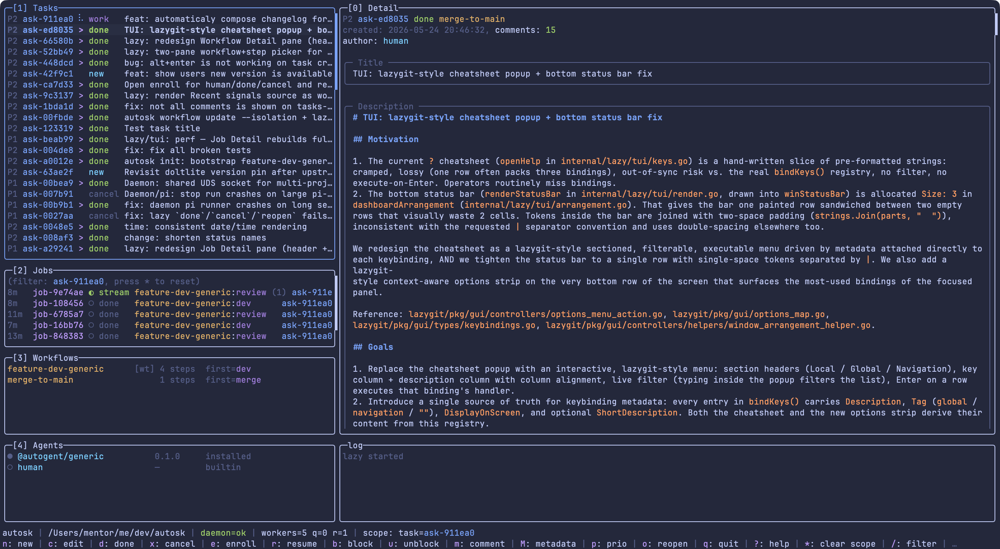

## What is autosk?

1. **task tracker**: small, local, file-based. One DB per repo. You can use it to scope agent attention to concrete context.
2. **workflow engine**: each workflow is a directed graph of **steps**, and each step is owned by an **agent** managed by engine.

You can stop at step 1 if all you want is a backlog. Step 2 is opt-in.

Inspired by [beads](https://github.com/steveyegge/beads) but simpler and more flexible. Use it as a plain backlog, or opt in to workflows when you're ready to let agents pick tickets up on their own.

```bash
$ autosk create "Wire up the auth flow" -p 1
ask-3f9b2c

$ autosk enroll ask-3f9b2c --workflow feature-dev-generic
# daemon picks it up, runs the agent pipeline, return to you when done or issue

# OR you can use your custom agents directly
$ autosk enroll ask-3f9b2c --agent @your-org/coding-agent
```

## Prerequisites

- **Install autosk** — either via Homebrew or from source:
```bash
brew install wierdbytes/autosk/autosk    # macOS / Linux
# or from a local checkout:
make install
```

- **[pi.dev](https://pi.dev)** - installed and configured for at least one LLM provider

also you need installed extension to let agents manage their state
```bash
pi install npm:@wierdbytes/pi-autosk
```

- **Node.js 22+** — if you want to use AI agents / workflows (we need it to install npm-packaged agents).

## Quick start

### [Lazy mode](docs/lazy.md)

Tasks, jobs, workflows, and agents in one screen. Selecting a job streams its transcript live into the Detail pane.

For TUI interface for easy manipulation and observability. Or go further and use CLI (see below).
```bash
cd ~/your/project
autosk lazy
```
Here you can press `n` to create new task or `?` to see hotkeys.

### [Desktop GUI](gui/README.md)

A native desktop app (Tauri: React/Vite UI + Rust backend) at feature parity
with `autosk lazy` — projects in a sidebar, a live session transcript, and a
state-aware composer (steer / follow-up / abort, comment / resume, enroll).
The Tauri backend is a **pure JSON-RPC client of `autoskd`**; the front end is
transport-agnostic and runs in either mode:

- **Local** — connects over the Unix-domain socket and **auto-spawns** `autoskd`
  when it isn't already running. Zero configuration, exactly like `autosk lazy`.
- **Remote** — dials a configured `host:port` and authenticates with a token
  (first request is `meta.auth{token}`). The remote `autoskd` must be running
  explicitly — you can't auto-spawn a process on another host. Set the mode and
  host/token in the in-app **Settings** view.

Run it from a checkout:

```bash
cd gui
npm install
npm run tauri:dev     # launch the desktop app (needs a display + webkit)
```

See [`gui/README.md`](gui/README.md) for the architecture, the IPC chokepoints,
and the full script list. To build and install a **release** build on desktop or
iPad, see [docs/gui-release.md](docs/gui-release.md).

### CLI

1. **Create your first task.** using CLI:
   ```bash
   cd ~/your/project
   autosk create "Tidy the README" -p 1
   autosk list             # everything that's open
   autosk ready            # what should I work on right now?
   autosk done ask-3f9b2c  # mark it finished
   ```

   The first write verb in a fresh directory prompts you to create
   `.autosk/db` and seeds the default `feature-dev-generic` workflow
   (see [How it works → Workflows](#workflows)). Press `Enter` (or `y`)
   to accept; press `n` to abort. `autosk init` is the explicit form
   and is idempotent; pass `--skip-bootstrap` if you don't want the
   default workflow seeded (handy for tests and offline CI). Scripts
   and CI auto-accept silently — see `AUTOSK_AUTOINIT_*` in
   [docs/workflows.md](docs/workflows.md#implicit-auto-init-from-other-verbs).

   The same prompt fires when you launch `autosk lazy` for the first
   time in a fresh project.

2. **(Optional) Hand a task to the bundled developer workflow.** `autosk init`
   already installed `@autogent/generic` and seeded `feature-dev-generic`
   (dev → review → docs → validator → human), so all that's left is to
   enroll a task:
   ```bash
   id=$(autosk create "Fix the flaky test" -p 1 --workflow feature-dev-generic --json | jq -r .id)
   ```
   The daemon — now the Rust `autoskd`, auto-spawned on first use (there is
   no manual `serve` step) — picks up the task, runs the workflow, and either
   closes it to `done` or parks it to `human` for review.

   The shipped `feature-dev-generic` workflow runs each task inside its
   own git worktree (`isolation: worktree`), so the project root must
   be a git repo. Existing projects whose workflow row was seeded
   before this default flip stay on `isolation=none` until you migrate
   manually — see [docs/workflows.md → Shipped default](docs/workflows.md#shipped-default-feature-dev-generic).

3. **(Optional) Use your own agent or workflow.** Install an agent
   package and enroll directly against it (autosk wraps it in a synthetic
   one-step workflow):
   ```bash
   autosk agent install @your-org/developer    # install once
   id=$(autosk create "Fix the flaky test" -p 1 --json | jq -r .id)
   autosk enroll "$id" --agent @your-org/developer
   ```

## How it works

autosk has four moving parts. You only need to touch them as you grow into them.

### Tasks

Tasks live in `.autosk/db` inside your repo. Each one has:

- An **id** like `ask-3f9b2c` and a **title**.
- A **priority** from `0` (highest) to `3` (lowest).
- A **status**: `new` (open work), `work` (an agent is on it), `human` (waiting for a person to process it), `done`, or `cancel`.
- Optional **blockers** — `autosk block <id> <blocker-id>` makes a task wait for another.

`autosk ready` returns the *ready set*: tasks in `new` status with no open blocker. That's what humans and agents pull from.

### Agents

An **agent** is a named actor that can own a task. `human` is seeded for you. AI agents come from **npm packages**, installed globally:

```bash
autosk agent install @your-org/developer
autosk agent list
```

Each package decides which model to call, what initial prompt to use, and how to behave during a **step**. You reference agents by their full package name in **workflows**; `human` is the only non-package agent.

### [Workflows](docs/workflows.md)

A **workflow** is a directed graph of **steps**, where each step has an agent and one or more outgoing transitions. Workflows can be as small as *one step, one agent*, or as branchy as *developer → reviewer → either back to developer or on to validator*.

You define workflows in JSON and load them into the DB:

```bash
autosk workflow create --file my-flow.json
autosk workflow list
```

`autosk init` seeds one workflow for you out of the box —
`feature-dev-generic` (`dev → review → docs → validator → human`,
every step owned by `@autogent/generic`, `isolation: worktree`). The
canonical JSON lives at
[`internal/bootstrap/feature-dev-generic.json`](internal/bootstrap/feature-dev-generic.json)
and is embedded into the binary; copy that file and pass it to
`autosk workflow create --file ...` under a different name if you want
to fork it.

For one-off uses, skip the workflow file and pass `--agent <pkg>` to `enroll` — autosk creates a synthetic single-step workflow for you on the fly.

See [Make your own workflow](docs/workflows.md#make-your-own-workflow) to adapt for your dev pipeline.

### The [daemon](docs/daemon.md)

The daemon — now the Rust **`autoskd`** — is a long-running process that drives tasks through their workflows. It is auto-spawned on first use by the `autosk daemon` subcommands (the Go `autosk daemon serve` verb was retired); for a foreground daemon, run `autoskd` directly. **One daemon per host serves any number of projects** — it picks the project from the autosk request that the CLI/lazy executes.

What the daemon does for each task in `work` status:

1. Resolves the current step's agent package.
2. Spawns the agent (either `pi --mode rpc` for standard packages, or a Node bootstrapper for custom runners).
3. Streams the agent's output to a `session.jsonl` archive and to any attached viewer (`autosk lazy`).
4. Waits for the agent to emit transitions calls and process the task accordingly.

If the agent fails to transition cleanly, the daemon parks the task to `human` and waits for you to resume it (`autosk resume <id>`).

```bash
autosk daemon list                   # what the daemon is doing in this project
autosk daemon list --all-projects    # ...across every loaded project
autosk daemon status   <job-id>
autosk daemon messages <job-id>
```

## License

MIT — see [LICENSE](LICENSE).
